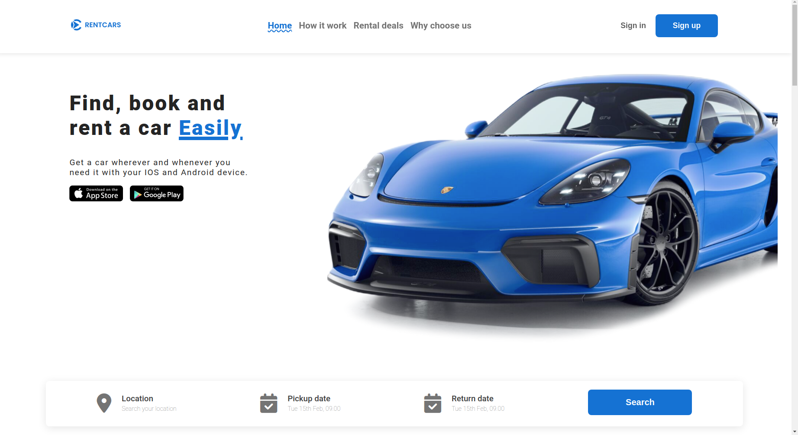

# Car Rental Project

A simple and user-friendly car rental application landing page built using HTML, CSS, and JavaScript.

# Project Image


## Features

- **Browse Cars**: View a list of available cars for rent.
- **Responsive Design**: Accessible on both desktop and mobile devices.

## Getting Started

### Prerequisites

- A modern web browser (e.g., Chrome, Firefox, Safari)

### Installation

1. Clone the repository:
   ```sh
   git clone [git@github.com:fabortwell/car-rental-landing-page.git]
   ```
2. Open the project directory:
   ```sh
   cd [car-rental-landing-page
Public
]
   ```

### Usage

1. Open `index.html` in your preferred web browser.
2. Start browsing, searching, and booking cars!

## Technologies Used

- **HTML**: Structuring the content.
- **CSS**: Styling the application.
- **JavaScript**: Interactivity and functionality.

## Contributing

Contributions are welcome! Feel free to fork the repository and submit pull requests.

## License

This project is licensed under the MIT License.

---
